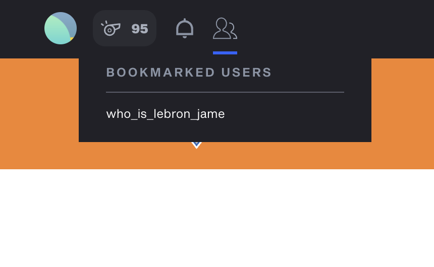

# Top Shot Toolkit

A Chrome extension to help make informed decisions when buying moments.

Get it on the [Chrome Web Store](https://chrome.google.com/webstore/detail/top-shot-toolkit/nhiijiajgkhdnggjnamiijohbbelagjj).

## Features

* Allows you to disable auto-playing videos on the "packs" page for a cleaner UI.
* Adds a chart which plots a Moment's current ask prices, top 3 sale prices, and other recent sale prices.
* Adds ability to sort by Moment serial or ask price when buying moments.
* Adds basic capability to "bookmark" other users for ease of navigation.

## Screenshots

### Moments Page

### Extension Menu

### Bookmark Users

## Support

If you find this extension useful and wish to give back, gift a moment to the author,
[`@who_is_lebron_jame`](https://www.nbatopshot.com/user/@who_is_lebron_jame). This is by no means required,
but is always appreciated.
